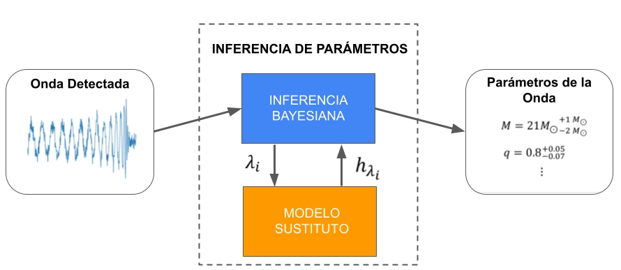
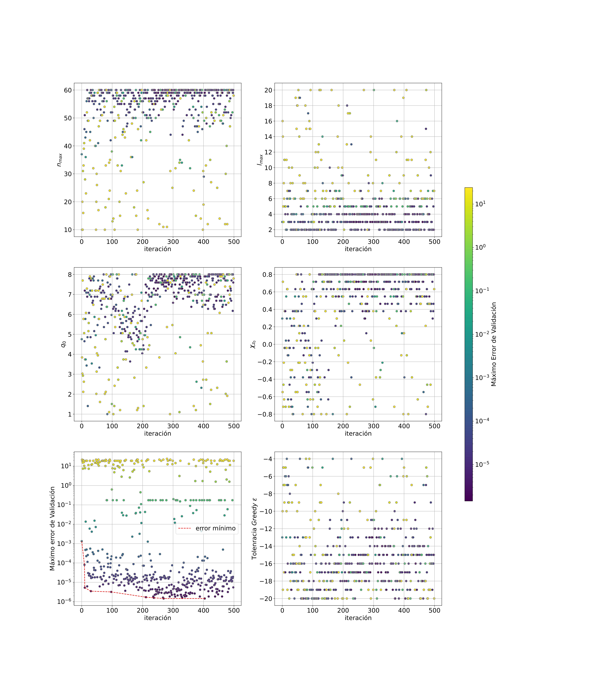

# Optimización de Hiperparámetros en Modelos Reducidos Adaptativos, con Aplicaciones a Ondas Gravitacionales y el Proyecto LIGO
## Tésis Licenciatura en Física

La inferencia de parámetros es el proceso por el cual se obtiene información de una onda gravitacional detectada. Este proceso requiere la construcción de multiples funciones de onda, lo cual requiere meses de cómputo en supercomputadoras utilizando relatividad numérica. 

Los modelos sustitutos son modelos entrenados puramente en datos, que logran un alto nivel de prescisión en tiempo real y una vez entrenados pueden correr en una computadora doméstica.

### Bases Reducidas

En el corazón de estos modelos reducidos se encuentra el método de las bases reducidas. En este trabajo se utilizó el refinamiento adaptativo hp-greedy, que ofrece una representación más precisa con un menor tiempo de evaluación, pero agregando la complejidad de tener que seleccionar una configuración óptima de hiperparámetros.

### Optimización de Hiperparámetros

Para la optimización de hiperparámetros se utilizó el algoritmo TPE implementado en la librería [Optuna](https://optuna.org/).

### Optimización realizada en Optuna

